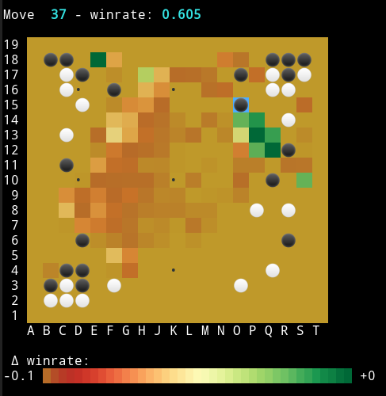

A website to improve your Go playing skills by training to predict which moves are good. [Try it now](https://go.furidamu.org/).

A traditional approach is to study games of professional players, and the moves they played. Putting this into an app, we could try to guess the next move in a game. However, this is not ideal: there can be more than one good next move, and ideally we would also like to know much worse an incorrect guess was.

Instead, we can use modern Go engines to analyse every possible move in a situation, record the value for all of them, and then only require that we guess one of the moves with the highest value.

The first step in this process is [analyse.py](analyse.py), a script to interface with KataGo and analyse sgf files. To make development easier, it also visualizes the resulting winrate estimates directly in the terminal:

